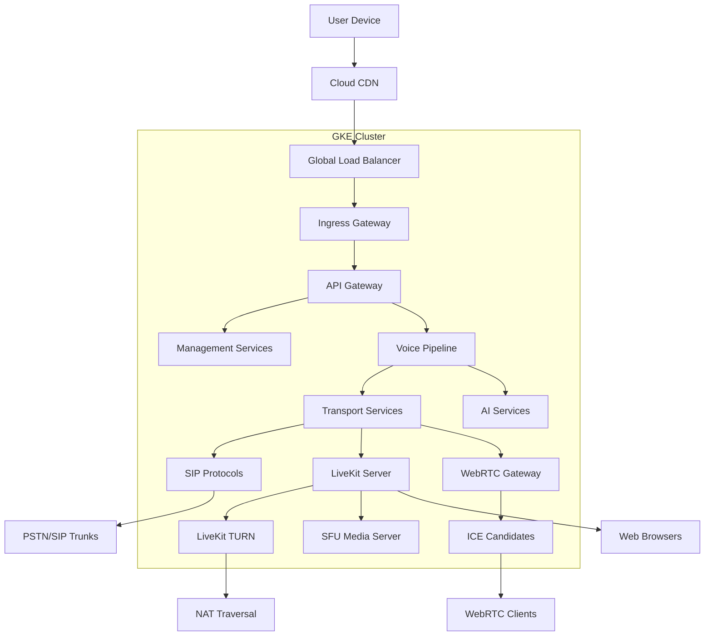
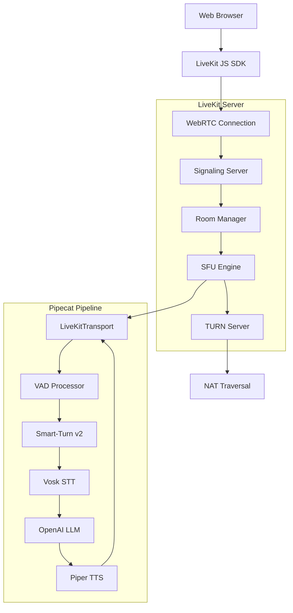

# Network Architecture

## Traffic Flow


## WebRTC Network Architecture

### LiveKit WebRTC Stack


### Network Flow Details

#### Connection Establishment
1. **ICE Gathering**: Browser collects local candidates
2. **Signaling**: Exchange SDP offers/answers via LiveKit
3. **DTLS Handshake**: Establish encrypted media channel
4. **SRTP Setup**: Secure real-time transport protocol
5. **Media Flow**: Bidirectional audio streaming begins

#### Audio Processing Pipeline
```
Browser Microphone → WebRTC Capture → LiveKit → Pipecat Pipeline
                                                       ↓
Browser Speakers  ← WebRTC Playback ← LiveKit ← Audio Processing
```

#### Port Configuration
```yaml
LiveKit Server:
  - 7880: WebRTC signaling (TCP)
  - 7881: TURN server (TCP/UDP)  
  - 7882-7950: ICE candidate range (UDP)

Network Requirements:
  - UDP: Required for media transmission
  - TCP: Fallback for restricted networks
  - STUN/TURN: NAT traversal support
```

## Service Mesh
- **Istio** for service-to-service communication
- **mTLS** for internal encryption
- **Circuit breakers** for resilience
- **Distributed tracing** with Jaeger

## WebRTC Security
- **DTLS**: End-to-end media encryption
- **SRTP**: Secure audio stream transport
- **Token Authentication**: LiveKit JWT tokens
- **Origin Validation**: CORS and domain restrictions
