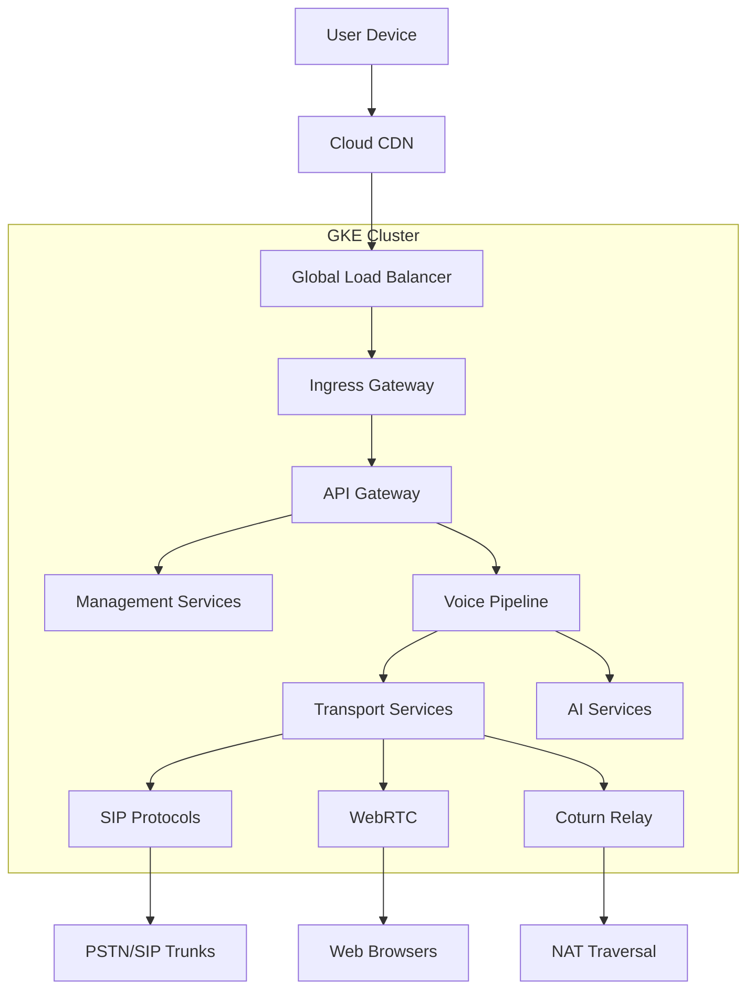

# Network Architecture

## Traffic Flow

## Service Mesh
- **Istio** for service-to-service communication
- **mTLS** for internal encryption
- **Circuit breakers** for resilience
- **Distributed tracing** with Jaeger
