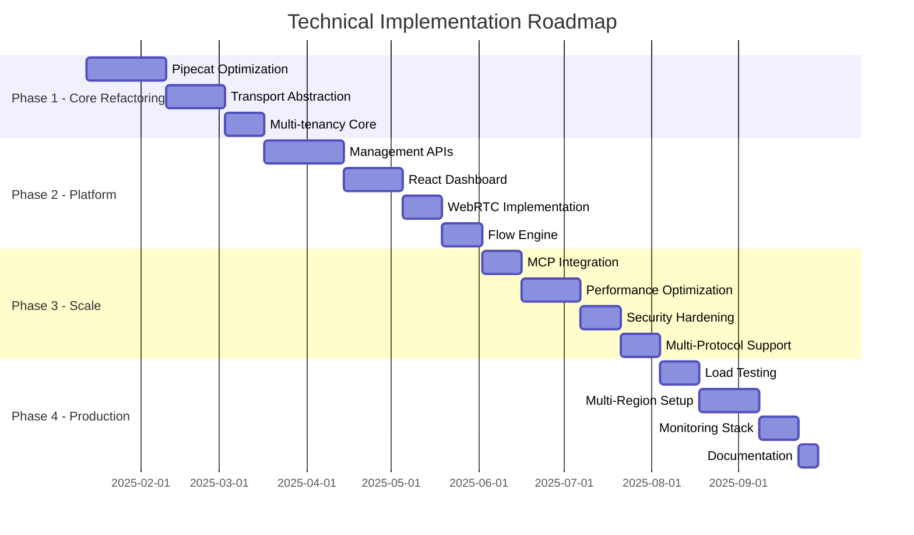

# Development Phases

```mermaid
gantt
    title Technical Implementation Roadmap
    dateFormat  YYYY-MM-DD
    
    section Phase 1 - Core Refactoring
    Pipecat Optimization    :2025-01-13, 4w
    Transport Abstraction   :2025-02-10, 3w
    Multi-tenancy Core      :2025-03-03, 2w
    
    section Phase 2 - Platform
    Management APIs         :2025-03-17, 4w
    React Dashboard         :2025-04-14, 3w
    WebRTC Implementation   :2025-05-05, 2w
    Flow Engine             :2025-05-19, 2w
    
    section Phase 3 - Scale
    MCP Integration         :2025-06-02, 2w
    Performance Optimization:2025-06-16, 3w
    Security Hardening      :2025-07-07, 2w
    Multi-Protocol Support :2025-07-21, 2w
    
    section Phase 4 - Production
    Load Testing            :2025-08-04, 2w
    Multi-Region Setup      :2025-08-18, 3w
    Monitoring Stack        :2025-09-08, 2w
    Documentation           :2025-09-22, 1w
```
